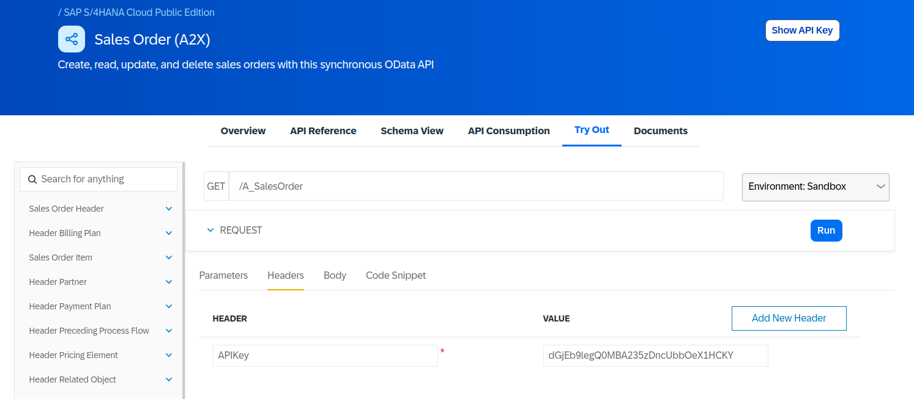

# SAP Cloud SDK application for Sales Order public API consumption

## Description

Simples application using [Nest](https://github.com/nestjs/nest) framework based on [SAP Cloud SDK Getting Started Tutorial](https://sap.github.io/cloud-sdk/docs/js/tutorials/getting-started/introduction) but consuming [Sales Order Public API](https://api.sap.com/api/API_SALES_ORDER_SRV/overview) instead of Business Partner.

## Project setup

```bash
$ npm install
```

## Compile and run the project

```bash
# development
$ npm run start

# watch mode
$ npm run start:dev
```

## Run tests

```bash
Install the VSCode REST Client extension and run the sample requests in this "test.http" file.
```

## Environment variable

Create .env file in project root folder with following content:
```
destinations = '[{ "name": "MockServer", "url": "https://sandbox.api.sap.com/s4hanacloud", "headers": { "APIKey": "dGjEb9legQ0MBA235zDncUbbOeX1HCKY"} }]'
```

## Disclaimer

API keys are hardcoded and was obtained from [Try Out](https://api.sap.com/api/API_SALES_ORDER_SRV/tryout) page for Sales Order Public API, perhaps it will eventually stop working so try to get a new one on [Try Out](https://api.sap.com/api/API_SALES_ORDER_SRV/tryout) .

<p align="center">
  
</p>

## Resources

Check out a few resources that may come in handy when working with NestJS:

- Visit the [NestJS Documentation](https://docs.nestjs.com) to learn more about the framework.
- [REST Client VSCode extension](https://marketplace.visualstudio.com/items?itemName=humao.rest-client)
- [Sales Order Public API](https://api.sap.com/api/API_SALES_ORDER_SRV/overview)
- [SAP Cloud SDK Getting Started Tutorial](https://sap.github.io/cloud-sdk/docs/js/tutorials/getting-started/introduction)
